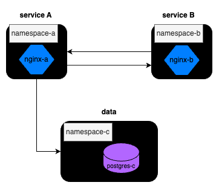

# Calico Network Policy

## Note

You can also follow along with the info through the Uplimit Course [here](https://uplimit.com/course/kubernetes-managing-containers-at-scale/v2/enrollment/enrollment_clj4nmkr201xv12aw259t4xtw/module/module_clm32558009hs12bt38101z0x).

## Background

In a multi-tenanted, distributed system architecture, where multiple services are deployed across different namespaces, it becomes crucial to establish network policies to regulate and secure service-to-service communication. This is the next move for StartUpCo.

We will use Calico as a network policy agent. Calico is a flexible and scalable networking and security solution that operates at the Kubernetes network layer. It provides a powerful framework for network policy enforcement by leveraging the inherent capabilities of the underlying network fabric. With Calico, organizations can create fine-grained policies to control traffic flow between namespaces, pods, and other resources, ensuring only authorized service-to-service communication.



We will construct the following networking scheme:

### Namespace A - Networking Policies
- **Ingress Policy for Namespace A:** A network policy should be defined in namespace A to specify the ingress rules. This policy ensures that only incoming traffic from services residing in namespace B is permitted. You can think of pods in namespace B returning responses from API requests to Service B. 
- **Egress Policy for Namespace A:** Namespace A can send requests to all other namespaces (B and C). You can think of pods in Namespace A as a website needing to send requests to Service B to get certain info and then writing those results to the data layer in namespace C.

### Namespace B - Networking Policies
- **Ingress Policy for Namespace B:** This policy ensures that services in namespace B only accept requests from services residing in namespace A, creating a request/response secure communication channel. 
- **Egress Policy for Namespace B:** To further create that bidirectional communication, an egress policy should be enforced in namespace B such that it restricts outgoing traffic from services in namespace A.

### Namespace C - Networking Policies
- **Ingress Policy for Namespace C:** A network policy should be defined in namespace C such that it only receives requests from namespace A. These can be considered write request to the data layer from Service A without the need of a returned response from said request.

## Setup

Run minikube with the following command:

```
cd calico
minikube start --network-plugin=cni --cni=calico
```

Also to start off the namespaces and pods, please run:

```
bash setup.sh
```

## Testing

We have configured [GitHub Actions](https://github.com/features/actions) with minikube! GitHub Actions works as a CI/CD tool but for our intents and purposes, we will use it to create an autograder for your `yml` file changes. To test, create a branch in our `intro-to-kube` repo prefixed with
`calico-*` and push changes up to that branch. [See the output of your results here for reference](https://github.com/abanuelo/intro-to-kube/actions/workflows/calico.yml).

```
# create your branch
git checkout -b calico-<github-username>
# add your local changes
git add .
# commit your changes
git commit -m "<describe changes made>"
# push your changes to your upstream branch
git push -u origin calico-<github-username>
```

## Main Project

For this assignment, we will be looking closely at the [Kubernetes Ingress and Egress policies from their documentation](https://kubernetes.io/docs/concepts/services-networking/network-policies/). As a starter, try to find ways you can either

- (a) identify the pods belonging to a particular namespace using names/labels OR
- (b) identify the entire namespace from their names/labels OR
- (c) (not recommended) using the pods explict IPs to redirect traffic. This is not recommended since pods are usually deployed as a Deployment and their IPs are subject to change if they are deleted, cordoned, etc.

0. Fill out networking policy for namespace A under `network-policy-namespace-a.yml` and test your changes by pushing up a branch prefixed with `calico-`. You can also aim to manually test your changes by running the following commands below:

    a. First you will need to install curl on the postgres pod as it does not come installed by default. **Note: You only need to do this once after creating the postgres pod**
    ```
    # exec into the container
    kubectl exec -it postgres -n namespace-c -- bash

    # once in the container run the `apt-get commands below`
    root@postgres/# apt-get -y update; apt-get -y install curl

    # exit the container
    root@postgres/# exit
    ```

    b. Next you can run gather the IPs for your pods by running:
    ```
    kubectl get pods --all_namespaces -o wide
    ```
    The ports for the nginx pods are 80 and 5432 for the postgres pod, respectively.

    c. To ping let's say the nginx pod from namespace A to the nginx pod in namespace B you can run:
    ```
    kubectl exec nginx -n namespace-a -- curl <nginx pod IP from namespace-b>:<nginx port (ie 80)>

    # example
    kubectl exec nginx -n namespace-a -- curl 10.244.120.72:80
    ```
    Or to ping from the nginx pod from namespace A to say the postgres pod in namespace-c you can trigger:
    ```
    kubectl exec nginx -n namespace-a -- curl <postgres pod IP from namespace-c>:<postgres port (ie 5432)>

    # example
    kubectl exec nginx -n namespace-a -- curl 10.244.120.70:5432
    ```

1. Fill out networking policy for namespace B under `network-policy-namespace-b.yml` and test your changes by pushing up a branch prefixed with `calico-`. See manual testing steps above under item 0. as needed.

2. Fill out networking policy for namespace C under `network-policy-namespace-c.yml` and test your changes by pushing up a branch prefixed with `calico-`. See manual testing steps above under item 0. as needed.

